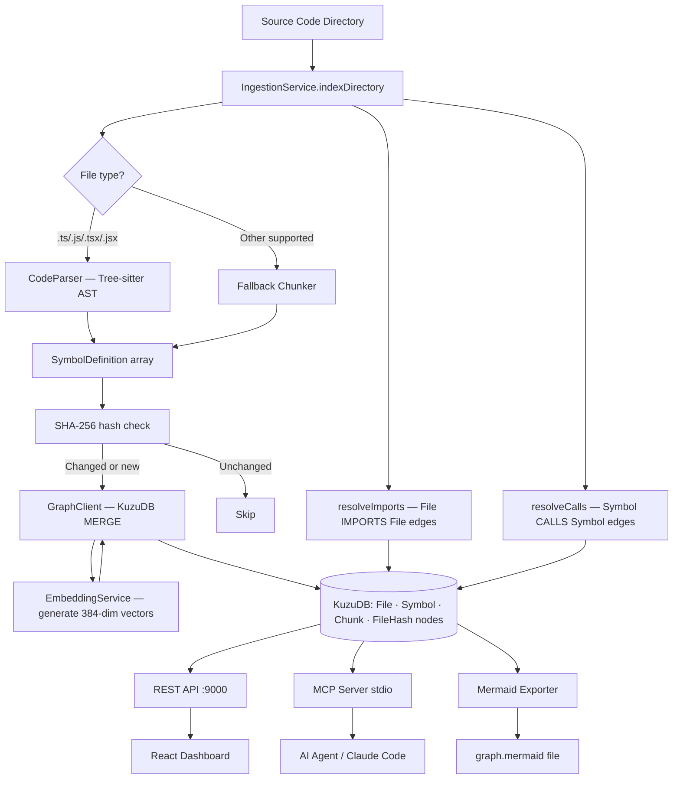

# GraphHub System Architecture

## Overview
GraphHub is a local-first code intelligence platform that transforms source code into a queryable knowledge graph. All data stays on the user's machine — no code is sent to external servers.

## Pipeline



## Component Breakdown

### 1. Ingestion Engine (`src/services/ingestion/`)

**`CodeParser`** — wraps `web-tree-sitter` (WASM). Extracts:
- `function`, `method`, `class`, `interface`, `variable`, `import` symbols
- Parameters (inputs), return type (outputs)
- Call expressions → `calls[]` list per symbol
- JSDoc / line comments → `doc` string
- TODO/FIXME/HACK markers → `technicalDebt[]`, `status`

**`IngestionService`** — orchestrates the full pipeline:
1. Parse file → symbols
2. Hash check (skip unchanged files)
3. MERGE File + Symbol nodes into KuzuDB
4. Generate embeddings for doc-commented symbols → MERGE Chunk nodes
5. After directory scan: resolve imports (cross-file edges) and calls

### 2. Knowledge Graph (`src/services/db/`)

**`GraphClient`** — singleton KuzuDB wrapper. One connection per process. Stores the graph in `.graphhub/db`.

**Schema:**
```
File ──CONTAINS──► Symbol ◄──DESCRIBES── Chunk
File ──IMPORTS──► File
Symbol ──CALLS──► Symbol
FileHash (incremental indexing state)
```

**`GraphExporter`** — converts the graph to Mermaid format with:
- One `subgraph` per source file
- `classDef` color coding per symbol kind
- `CALLS` edges (solid arrows), `IMPORTS` edges (dashed)

### 3. AI / RAG Layer (`src/services/ai/`)

**`EmbeddingService`** — local-only, zero-API-cost. Uses `Xenova/all-MiniLM-L6-v2` (384 dimensions) via `@xenova/transformers`.

**`RAGService`** — brute-force cosine similarity search over all `Chunk` nodes. Suitable for projects up to ~10k files. For larger projects, Kuzu's ANN index can be enabled.

### 4. MCP Server (`src/services/mcp/`)

Implements [Model Context Protocol](https://modelcontextprotocol.io/) over `stdio`. Allows AI agents (Claude Code, Cursor, etc.) to query the graph.

**Tools:**
| Tool | Purpose |
|---|---|
| `query_graph` | Raw Cypher queries |
| `get_file_symbols` | Symbols in a file |
| `semantic_search` | RAG search |
| `get_context` | Callers + callees of a symbol |
| `impact_analysis` | Blast radius (d=1 direct, d=2 indirect callers) |

### 5. REST API (`src/services/api/`)

Express server on port 9000, used by the React dashboard.

### 6. React Dashboard (`dashboard/`)

React + TypeScript + Vite. React Flow renders the interactive graph with Dagre auto-layout. See `dashboard/README.md` for full details.

## Concurrency & Performance

- Indexing is single-threaded (sequential file processing). Worker thread support is a planned enhancement for large repos.
- Incremental indexing via SHA-256 file hashing means re-runs skip unchanged files.
- KuzuDB is not safe to open from multiple processes simultaneously — the API server and CLI indexer share one `.graphhub/db` path.

## Data Privacy

- The `.graphhub/` directory lives in the project root. All graph data is local.
- Embeddings are generated locally — no network calls.
- No telemetry or external services.
